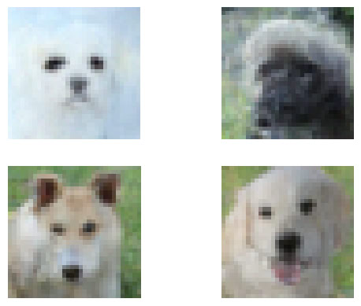

# Diffuse_model
This is a proof-of-concept for the implementation of Diffusion-Models in Python (https://arxiv.org/pdf/2006.11239.pdf)

## 250 Epoch samples

### Data
[Animal Faces](https://www.kaggle.com/datasets/andrewmvd/animal-faces)

Thanks to  [dome272](https://github.com/dome272/Diffusion-Models-pytorch) and [hojonathanho](https://github.com/hojonathanho/diffusion/tree/1e0dceb3b3495bbe19116a5e1b3596cd0706c543) for the explanation